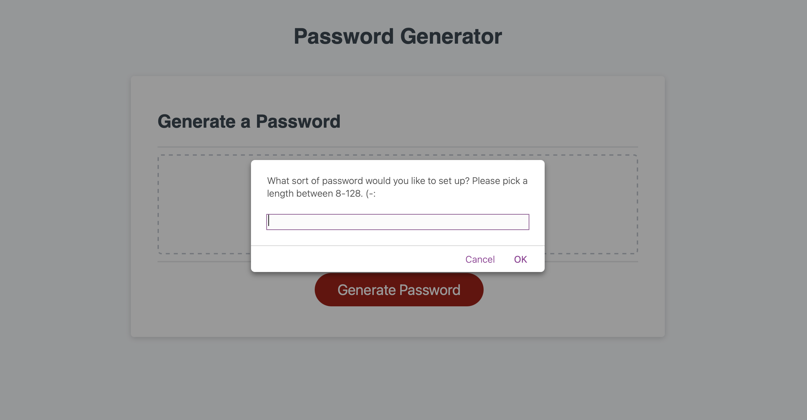
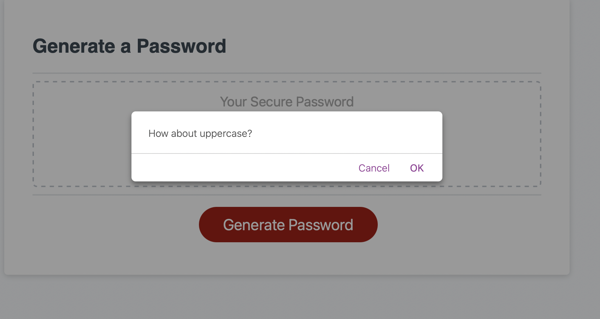
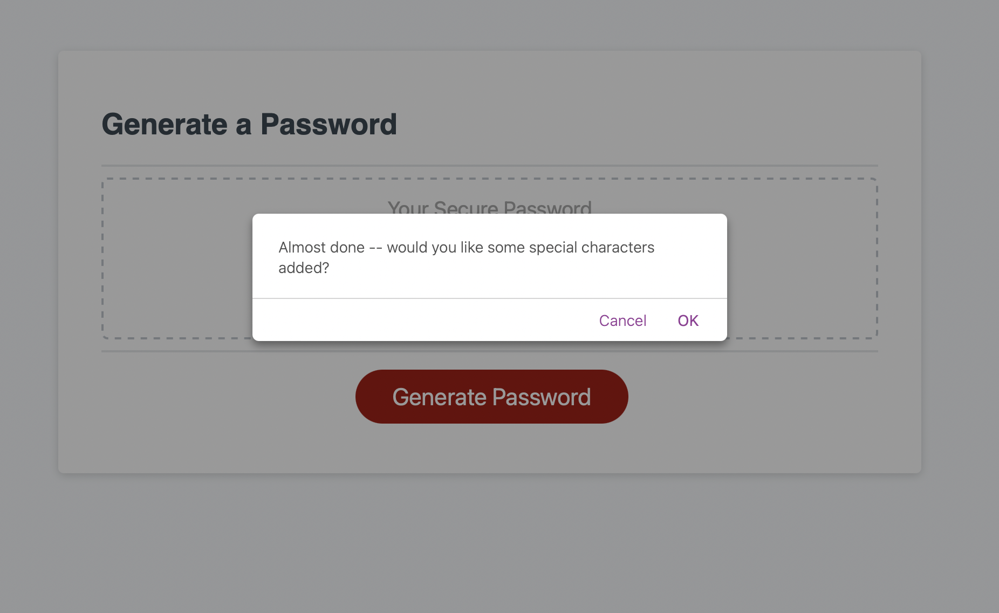
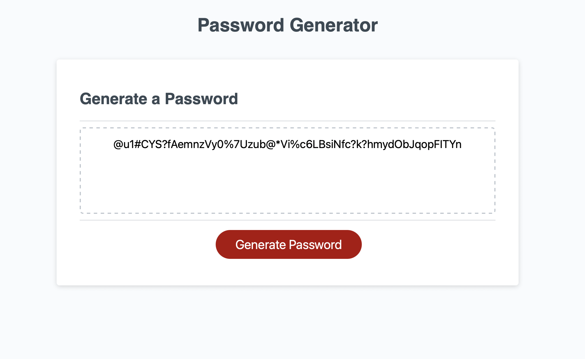

# pressing-passwords

<h1> Screenshots ~ </h1>

<h1> Description </h1>
This was a project that was (painstakingly difficult) to utilize, despite having the starter code. It felt as if I had started from scratch, truthfully. (Baby) walking through the steps, however, allowed for a more flowing response, and less mistakes, throughout. I found it easiest to begin from the prompts, and user interfaces, and going from there. 

Overall, however, the intent of this project was for the user to create a semi-personalized string of passcodes. They, as the user, picked from several variables (whether to include special characters, upper/lowercase, and numbers) and chose to either utilize them or refrain from using them. Total customization. 

<h1> Credits </h1>
My biggest thanks (and all of my heart) to Axel, Ming, and Rainier, who did double study groups with me, in order to make sure my code was fluent, and I understood the entire process. 

& to Lindsay, for moral support and guidance, as to William and Joe, who dealt with my silly questions during both morning and evening office-hours. 

& finally, to Mosh Hamedani, whose videos I spontaneously purchased to further understand JS during my weekend-study hours. I will link his workshop below. (Best 30 dollars, ever spent!!!)
https://codewithmosh.com

& to the my tiny human, who will occasionally keep me company (and slam the door, frequently) during class, who keeps me from burning out. 

<h1> Licensing </h1>
Standard Licensings apply, however, feel free to pull the code -- please, just ask prior to. Thank you (-:

<h1> Deployed Link </h1>
https://yond3r.github.io/pressing-passwords/

